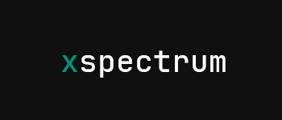
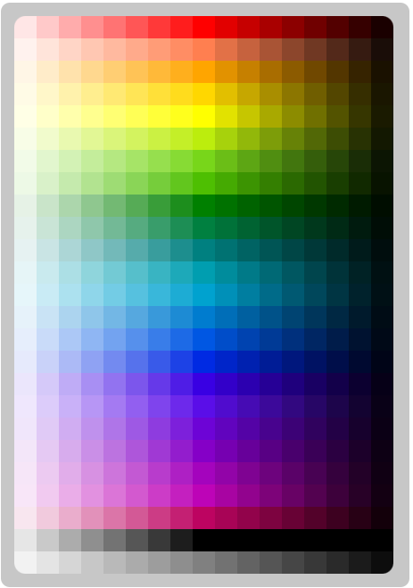

**_xspectrum-styled_** is a style library for Modern React.

Generate a styled component with media queries with an easy-to-use schema and type definition.

# Key Features

- **CSS-in-JSX Prop Generation**: Automatically generate CSS props for your components for inline styling without having to use the style prop directly.
- **Media Queries**: Encourages developers to easily write responsive components by default.
- **Color Reshade**: Create variations of your colors in real-time or build time.
- **Faster Iteration**: Thanks to its composable nature, it's easy to change colors while keeping lumen at fine control, allowing for faster rebranding among other solutions.

# Installation

To install this library, you can run any of the following commands (only one):

We highly recommend using yarn.

```sh
yarn add xspectrum-styled
```

But you can still use npm.

```sh
npm install xspectrum-styled
```

# Quick Start

## CSS-in-JSX

`xspectrum-styled` allows you to write CSS directly within your JSX, making it easy to style components dynamically and conditionally.

## Media Queries

The `createStyled` function returns a wrapper around your component that applies the given style and subscribes it to changes from your device to apply any media queries you provide to the schema automatically.

In this case, we conditionally apply a padding override when the device is "medium-size".

```jsx
export const StyledView = createStyled(View, {
  backgroundColor: "blueViolet.800",
  padding: 20,
  "@md": {
    padding: 25,
  },
});
```

For more details regarding the media queries or breakpoints (which can be customized), see this link.

## Color System

Any color-like prop on your styled component can apply a shade to a built-in color or a color from a theme. The library comes with a set of built-in colors, with shade values ranging from 100 to 900 in increments of 50.



## Themes

`xspectrum-styled` supports themes to provide consistent styling across your application. You can define your own theme or use a pre-defined one.

## Metrics

Define consistent spacing and sizing across your application using the built-in metrics system.

## Breakpoints and Sizes

Customize and use different breakpoints for responsive design. The default breakpoints are:

- us: 360px
- xs: 576px
- sm: 768px
- md: 992px
- lg: 1200px
- xl: 1600px
- 2k: 2048px
- 4k: 3840px

The library also provides default sizes that you can use to create consistent, responsive designs.

Default Sizes:

- us: 8
- xs: 12
- sm: 16
- md: 20
- lg: 24
- xl: 32
- 2k: 48
- 4k: 72

Use these constants to create a consistent, responsive design system across your application.

## Demo

Here is a full example of how to use most of the library.

```jsx
export const Card = createStyled(View, {
  backgroundColor: "blueViolet.800",
  padding: 20,
  borderRadius: 10,
  shadowColor: "darkBlue.800",
  shadowOffset: { width: 0, height: 2 },
  shadowOpacity: 0.8,
  shadowRadius: 2,
  elevation: 5,
  margin: 10,
});

export const StyledText = createStyled(Text, {});

export const StyledPressable = createStyled(Pressable, {
  backgroundColor: "lightGreen.500",
  padding: 10,
  borderRadius: 5,
  alignItems: "center",
  justifyContent: "center",
  marginTop: 20,
});

export default function Page(props) {
  return (
    <Card>
      <StyledText color="white.900" fontSize={18} fontWeight="bold">
        Card Title
      </StyledText>
      <StyledText color="gray.300" marginTop={10}>
        This card component demonstrates how to use styled components with a color palette for consistent theming.
      </StyledText>
      <StyledPressable>
        <StyledText color="white.900">OK</StyledText>
      </StyledPressable>
    </Card>
  );
}
```
