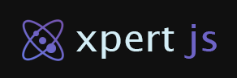

<p align="center">
  
</p>

**xp.js(alpha)** is a framework for cross-platform React applications.

**xp.js-styled** is an single package from that framework.

The goal of this package is to build complex styled components with an easy-to-use schema definition.

**Disclamer:** Still in development, expects bugs as we get to stable 1.0.0

# Key Features

- **CSS-in-JSX**: Automatically generate CSS-in-JSX props for your components, making easy to inline style without having to use the prop directly.
- **Media Queries**: Encourages developers to easily design and write responsive components by default, with their extremely simple media queries API.
- **Color Shade**: Create re-shades of your colors in realtime with a simple lumen range syntax.
- **Faster Iteration**: Thanks to its nested nature, it's easy to change, allowing for faster rebranding among other styling solutions.

# Quick Start

The following guide will teach you how to get this library working rather fast:

## Installation

To install this library, you can run any of the following commands (only one):

We highly recommend using yarn.

```sh
yarn add xp.js-styled
```

But you can still use npm as well.

```sh
npm install xp.js-styled
```

## CSS-in-JSX

The `createStyled` function returns a high order wrapper around your component that applies the given style schema.
Then the styled component subscribes to changes from your device, to apply any media queries, variants and stylesheets automatically for you.

Let's start creating a plain StyledView.

```jsx
export const StyledView = createStyled(View);
```

Then, this StyledView now can be inline styled with ease.
Notice we pass backgroundColor, fontSize and fontWeight as plain props.

```jsx
export default function Page() {
  return (
    <StyledView backgroundColor="nature.900" fontSize={18} fontWeight="bold">
      ...
    </StyledView>
  );
}
```

## Media Queries

Exploring further into, of course you can create your styled components with a base schema, that will be applied
as the global style for that component, but with the option to iterate the styles more with the inline styled.

Now, in this case, we conditionally apply a style override when the device is "medium-size".

```jsx
export const StyledView = createStyled(View, {
  backgroundColor: "blueViolet.800",
  padding: 20,
  "@md": {
    backgroundColor: "blueViolet.700",
    padding: 25,
  },
});
```

For more details regarding the media queries, this table contains the full list:

| Media Query | Description                                                                               |
| ----------- | ----------------------------------------------------------------------------------------- |
| @light      | Targets devices or user settings that prefer a light color scheme.                        |
| @dark       | Targets devices or user settings that prefer a dark color scheme.                         |
| @ios        | Targets devices running the iOS operating system, such as iPhones and iPads.              |
| @android    | Targets devices running the Android operating system, such as Android phones and tablets. |
| @macos      | Targets devices running the macOS operating system, such as MacBooks and iMacs.           |
| @windows    | Targets devices running the Windows operating system, such as PCs and laptops.            |
| @web        | Targets web-based platforms and browsers.                                                 |
| @us         | Targets devices with very small screens, typically less than 320px in width.              |
| @sm         | Targets devices with small screens, typically between 320px and 600px in width.           |
| @md         | Targets devices with medium screens, typically between 601px and 1024px in width.         |
| @lg         | Targets devices with large screens, typically between 1025px and 1440px in width.         |
| @xl         | Targets devices with extra-large screens, typically between 1441px and 1920px in width.   |
| @2k         | Targets devices with 2K resolution screens, typically between 1921px and 2560px in width. |
| @4k         | Targets devices with 4K resolution screens, typically between 2561px and 3840px in width. |

## Color System

The library comes with a set of built-in colors, with shade values ranging from 100 to 900 in increments of 50.
Any color can use this behaviour, even custom colors.


**List of Built-in Colors**

| Color Name  | Color Key  | Color Value |
| ----------- | ---------- | ----------- |
| Red         | red        | #FF0000     |
| Coral       | coral      | #FF7F50     |
| Orange      | orange     | #FFA500     |
| Gold        | gold       | #FFD700     |
| Yellow      | yellow     | #FFFF00     |
| Lime        | lime       | #BCED0D     |
| Light Green | lightGreen | #78D61A     |
| Green       | green      | #4EBF02     |
| Dark Green  | darkGreen  | #008000     |
| Nature      | nature     | #008040     |
| Teal        | teal       | #008080     |
| Aqua        | aqua       | #009eb0     |
| Sky         | sky        | #00a2cf     |
| Light Blue  | lightBlue  | #007CCF     |
| Blue        | blue       | #0057E3     |
| Dark Blue   | darkBlue   | #002AE3     |
| Blue Violet | blueViolet | #3900E3     |
| Violet      | violet     | #5A0EE8     |
| Indigo      | indigo     | #6D04D6     |
| Purple      | purple     | #8500C7     |
| Magenta     | magenta    | #A404BD     |
| Pink        | pink       | #BD04B7     |
| Hot Pink    | hotPink    | #BD0461     |
| Black       | black      | #000000     |
| Gray        | gray       | #808080     |
| White       | white      | #FFFFFF     |

## Themes

Now, in case you need to share styles across multiple styled components, even with their responsiveness, then you can use a theme.

```jsx
export const Theme = createTheme({
  styles: {
    container: {
      padding: 5,
      margin: 5,
      "@2k": {
        margin: 5,
        padding: 5,
      },
    },
    center: {
      alignItems: "center",
      justifyContent: "center",
    },
  },
});

export const Card = createStyled(View, {
  theme: Theme,
  parentStyles: ["container", "center"],
});

export const Banner = createStyled(View, {
  theme: Theme,
  backgroundColor: "yellow.400",
  parentStyles: ["container"],
});
```

## Sizing and Breakpoints

Define consistent spacing and sizing across your application using the built-in metrics system.

By default, if you don't provide sizing values, recommended values will be used.

**The default breakpoints are:**

| Breakpoint | Width  |
| ---------- | ------ |
| us         | 360px  |
| xs         | 576px  |
| sm         | 768px  |
| md         | 992px  |
| lg         | 1200px |
| xl         | 1600px |
| 2k         | 2048px |
| 4k         | 3840px |

**The default sizes are:**

| Breakpoint | Size |
| ---------- | ---- |
| us         | 8    |
| xs         | 12   |
| sm         | 16   |
| md         | 20   |
| lg         | 24   |
| xl         | 32   |
| 2k         | 48   |
| 4k         | 72   |

Use these constants to maintain a consistent and responsive design system across your application, however you can customize those values in a theme.

# Quick Demo

Here is a full example of how to use most of the library.

```jsx
export const Card = createStyled(View, {
  backgroundColor: "blueViolet.800",
  padding: 20,
  borderRadius: 10,
  shadowColor: "darkBlue.800",
  shadowOffset: { width: 0, height: 2 },
  shadowOpacity: 0.8,
  shadowRadius: 2,
  elevation: 5,
  margin: 10,
});

export const StyledText = createStyled(Text);

export const StyledPressable = createStyled(Pressable, {
  backgroundColor: "lightGreen.500",
  padding: 10,
  borderRadius: 5,
  alignItems: "center",
  justifyContent: "center",
  marginTop: 20,
});

export default function Page(props) {
  return (
    <Card>
      <StyledText color="white.900" fontSize={18} fontWeight="bold">
        Card Title
      </StyledText>
      <StyledText color="gray.300" marginTop={10}>
        This card component demonstrates how to use styled components with a color palette for consistent theming.
      </StyledText>
      <StyledPressable>
        <StyledText color="white.900">OK</StyledText>
      </StyledPressable>
    </Card>
  );
}
```
